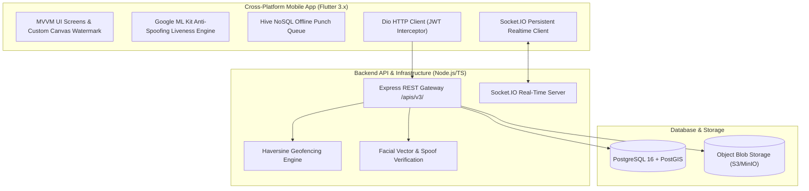

# ONSITE CLONE: FULL-STACK CONSTRUCTION ERP & WORKFORCE PLATFORM

A production-grade, enterprise Construction Site Management & Workforce ERP platform built with **Flutter 3 / Dart 3** for cross-platform mobile (Android & iOS) and **Node.js (TypeScript/Express & Socket.IO)** with **PostgreSQL (PostGIS)** for backend microservices.

---

## 🏗️ SYSTEM ARCHITECTURE & TECH STACK



---

## 📱 FRONTEND (FLUTTER MOBILE APP)

### Core Capabilities
* **Offline-First Reactive Architecture**: `Hive` NoSQL binary boxes store punch records, user sessions, and inventory cache when working offline in remote construction sites.
* **Camera Overlay & Canvas Watermark Engine**: Custom `OvalFramePainter` for face alignment + `WatermarkOverlayPainter` rendering immutable GPS coordinates, UTC timestamp, site code, and verification tag directly onto site photos.
* **Interactive Anti-Spoofing Liveness Verification**: ML Kit challenge pipeline prompting random sequences (`Blink`, `Turn Left/Right`, `Tilt`, `Smile`) before punch authorization.
* **5-Tab Persistent Navigation**:
  1. 🏠 **Home Dashboard**: Quick action grid, active project summary, daily workforce & payment KPIs.
  2. 👥 **Attendance**: Roster, self-punch camera, foreman bulk squad punch (50+ workers).
  3. 📦 **Materials & Sites**: Stock balance levels, low stock badges, PO creation, GRN receipt, inter-site material transfers.
  4. 💬 **Chat / Channels**: Real-time project channels with media & photo attachments via Socket.IO.
  5. ⚙️ **Approvals / Financials**: Multi-tier payment request pipeline (Level 1, Level 2, Director approval) & expense bottom sheet.

---

## ⚙️ BACKEND API & REAL-TIME WEBSOCKET

### Endpoint Blueprint (`/apis/v3/`)

| Method | Endpoint | Description |
| :--- | :--- | :--- |
| `POST` | `/apis/v3/auth/send-otp` | Sends SMS OTP with rate limiting |
| `POST` | `/apis/v3/auth/verify-otp` | Verifies OTP, returns JWT tokens `{ access_token, refresh_token }` |
| `POST` | `/apis/v3/scan/login/qr` | Desktop QR authentication via mobile camera scan |
| `GET`  | `/apis/v3/country-configuration` | Country phone validation & currency metadata (INR ₹, AED, SAR, NPR) |
| `POST` | `/apis/v3/add/punch_in` | Submits punch-in with face liveness proof & GPS geofence validation |
| `POST` | `/apis/v3/add/punch_out` | Submits punch-out & computes overtime |
| `POST` | `/apis/v3/bulk/punch_in_out` | Batch punch-in/out for worker squads (Foreman mode) |
| `POST` | `/apis/v3/add/companyuserfaceinfo` | Enrolls worker 128-dimensional face embedding vectors |
| `GET`  | `/apis/v3/list/attendance/payroll` | Returns monthly timesheets & gross disbursement calculation |
| `GET`  | `/apis/v3/list/all/project` | Projects assigned to active user |
| `POST` | `/apis/v3/add/daily-progress-report` | Submits end-of-day DPR (Weather, Manpower, Materials, Photos) |
| `GET`  | `/apis/v3/get/dpr-pdf/:id` | Generates and returns compiled PDF report |
| `GET`  | `/apis/v3/list/material/stock` | Live stock levels with low-stock warning badges |
| `POST` | `/apis/v3/add/materialpurchase` | Records Purchase Order (PO) |
| `POST` | `/apis/v3/bulk/add/material/grn` | Batch Goods Receipt Note (GRN) confirmation |
| `POST` | `/apis/v3/add/material-transfer/out` | Initiates site-to-site transfer out |
| `POST` | `/apis/v3/add/material-transfer/in` | Acknowledges received material transfer in |
| `POST` | `/apis/v3/add/payment-request` | Submits expense claim or vendor payout |
| `POST` | `/apis/v3/approval/action` | Approve/Reject (`status: APPROVED \| REJECTED`) |
| `GET`  | `/apis/v3/list/approval/feature/projectlevel` | Multi-tier approvals queue |

---

## 🗄️ DATABASE SCHEMA (`database/schema.sql`)

Includes PostGIS spatial support and tables:
1. `companies` — Multi-tenant hierarchy, country currency (INR ₹, AED, SAR, NPR), tax IDs.
2. `users` — Roles (`SUPER_ADMIN`, `PROJECT_MANAGER`, `SITE_ENGINEER`, `FOREMAN`, `WORKER`), trade rates, salary models.
3. `user_face_embeddings` — Facial biometric vector store.
4. `projects` — Geofence boundary center coordinates & radius threshold (e.g. 200m).
5. `attendance` & `attendance_liveness_logs` — Punch logs, Haversine distance out-of-bounds flag, liveness scores.
6. `materials`, `material_stocks`, `purchase_orders`, `grn_records`, `material_transfers`.
7. `payment_requests` & `payment_approval_logs` — Multi-tier financial approval workflow.
8. `equipment_registry`, `equipment_trips`, `fuel_issue_logs`, `compliance_vault`.
9. `dpr_reports`, `dpr_manpower`, `dpr_materials`.
10. `chat_channels` & `chat_messages`.

---

## 🚀 RUNNING & VERIFYING THE PROJECT

### 1. Start & Test Backend API
```bash
cd backend
npm install
npx tsc
node dist/test_api.js
```

To run the live server:
```bash
npm run dev
```

### 2. Run Mobile App (Flutter)
```bash
cd mobile
flutter pub get
flutter run
```

---
*Built with Antigravity AI Architecture.*
